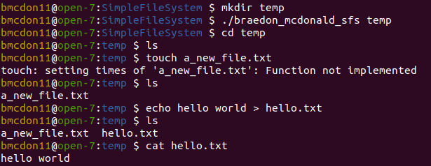

# SimpleFileSystem

This is an implementation for a unix-like file system that exists in the user 
space of a Linux operating system and uses FUSE to link the filesystem with the 
kernel.

The file system supports 512 files with 8 megabytes of total storage.
The file system does not support subdirectories or concurrent access. All files are stored in the root directory.

## Usage
1. ensure that the line containing fuse_wrappers.c is uncommented in the makefile
2. run make
3. run: ./braedon_mcdonald_sfs \<dir\> to mount the file system
4. create and manipulate files within the mounted directory
5. to unmount run: fusermount -u \<dir\>

## Pseudo code

The following sections provide pseudo code for the major operations of the file
system

### Inialize File System
1. Initialize the disk by calling init_fresh_disk(), giving it a block size of 
   1024 bytes and a total of 8,388,674 blocks (8 megabytes)
2. Initialize the fields of the super block struct with the values described in
   question 1 and write it to the first block of the disk
3. Initialize the fields of the struct representing the inode of the root 
   directory and write it to the first entry of the inode table

### Create File 
1. search the cached inode table for the next available inode number by 
   starting at the beginning of table and find the first entry whose "valid"
   is set to false
2. add the filename to inode mapping to the end of the cached root directory
   dynamic array
3. write the filename to inode mapping to the end of the on-disk disk root 
   directory. Use the free space bitmap if another block is needed to
   store the mapping
4. initialize an inode structure for the file and write it to the appropriate
   entry in the cached and on disk inode tables

### Write To a File 
1. Get the open file descriptor from the open file descriptor table
2. Get the disk block pointed to by the descriptors write pointer. Allocate a 
   a new block to the inode if necessary
3. while there is data to write:
   update the current in-memory block with data from the buffer. When the block
   is full, write it to disk and allocate/retrieve the next block
4. update the size of the file

### Remove a File 
1. deallocate the data by marking all the blocks pointed to in the file's 
   inode as free in the free space bitmap
2. remove the inode to filename mapping in the cached root directory table
   and shift the contents so that there are no gaps in the table
3. update the on-disk root directory
4. if the previous step results in one less block needed to store the on-disk
   root directory, mark this block as free in the free space bitmap and remove
   its pointer in the root directory's inode
5. mark the inode as invalid in the cached and on disk inode tables